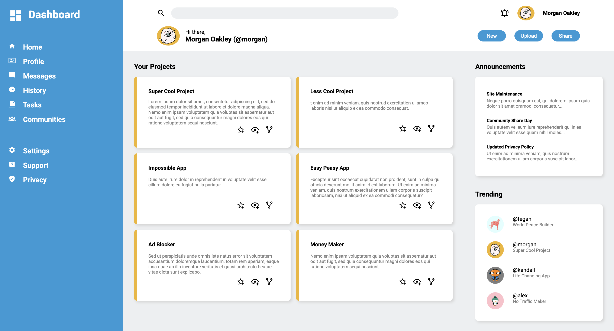

# admin-dashboard
Live preview can be found <a href="https://motokaneyuki.github.io/admin-dashboard/">here</a>.

# Purpose
This project was created to practice CSS layout techniques, specifically focusing on building a complex dashboard interface.

The goal of this project was to master:

- CSS Grid: Used for the high-level layout of the sidebar, header, and main content area.

- Flexbox: Used for aligning items within the header, sidebar navigation, and dashboard cards.

# Technologies Used
HTML5

CSS3

# Future plans
Responsive design for mobile and tablet views

Dark mode toggle

# Attributions

Icons from <a href="https://pictogrammers.com/library/mdi/">Pictogrammers</a>